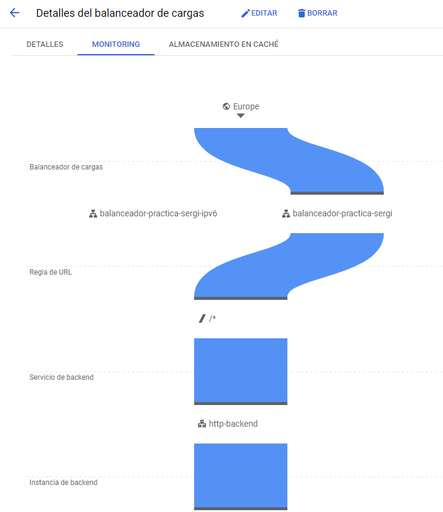

# Migración a la Nube con Google Cloud Platform (GCP) - Sergi Castillo

**Proyecto ID:** `sergicastillogcp`

## Arquitectura


### Balanceador de Carga




**Nombre del script:** `script.sh`
# Cuarta Parte

### Comandos para implementar la aplicación en App Engine:

```bash
# Comando para implementar la aplicación en App Engine:
gcloud app deploy

# Modificar el nombre del servicio e indicar la versión
gcloud app deploy --version=version-1-0-0

# Desplegar otra versión de la aplicación
gcloud app deploy --version=version-2-0-0

# Cambiar la distribución del tráfico al 50% entre las dos versiones
gcloud app services set-traffic "practica" --splits=version-1-0-0=50,version-2-0-0=50 --split-by=random
```
# Bonus

### Una vez completado el archivo de configuración main.tf de Terraform, ejecuta los siguientes comandos:
```bash
# Ejecutamos terraform apply, el cual ejecutará también un terraform plan.
terraform apply

# Si todo está correcto escribimos "yes" para ejecutar los comandos del archivo.

# Eliminar todos los recursos creados con Terraform
terraform destroy
```
